# OnsenUI Cordova Plugins integration test

> The purpose of this project is to test the compatibility among vuejs, onsenui, cordova, and several cordova plugins.

## Build Setup

``` bash
# install dependencies
npm install

# serve with hot reload at localhost:8080
npm run dev

# build for production with minification
# this will build our project into the www folder
npm run build

# build for production and view the bundle analyzer report
npm run build --report
```

## Cordova related command

Install all cordova plugins and platform

``` bash
cordova prepare
```

To update the app that cordova is aware of, you need to build the Vue app with npm run build. This will clean and build the www folder.

``` bash
# run and install in android
npm run cordova-run-android

# build APK debug file 
npm run cordova-build
```

## Screenshots

Home Page <br/>
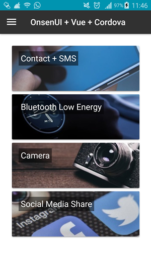
<hr/>

Contact Page <br/>
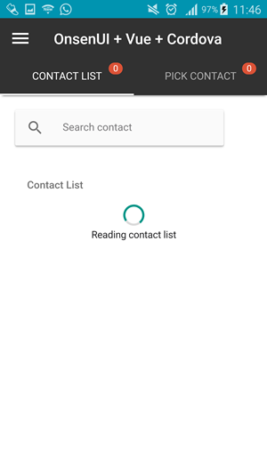
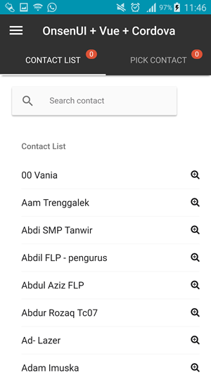
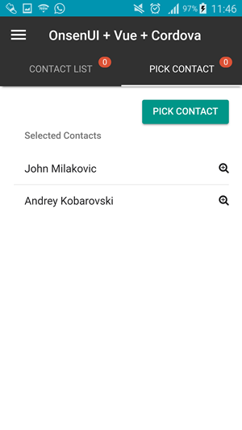
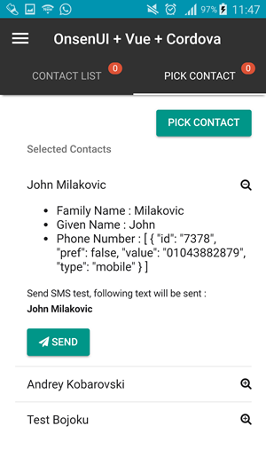
<hr/>

Bluetooth Scan Page <br/>
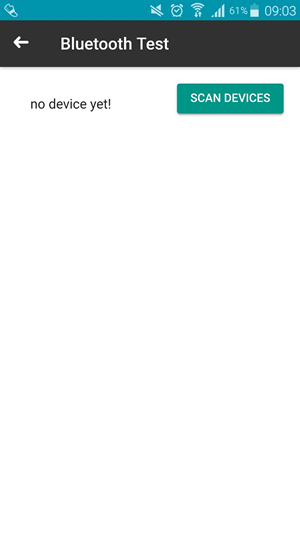
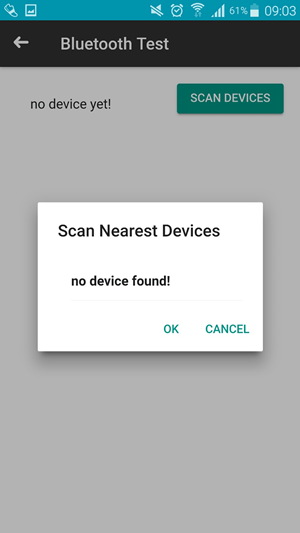
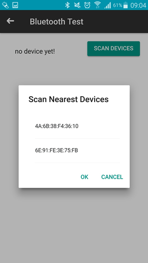
<hr/>

Camera + Gallery Page <br/>
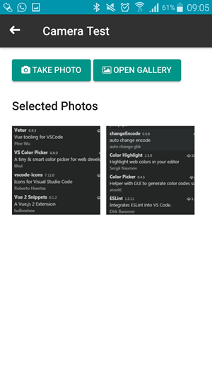
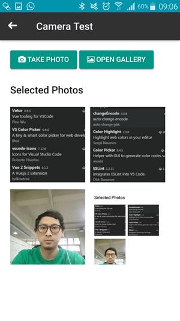
<hr/>

Social Media Share <br/>
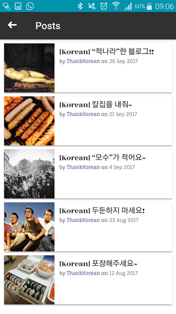

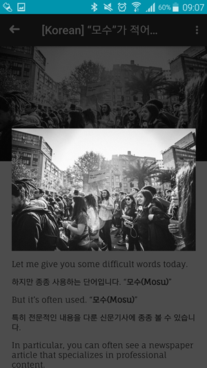
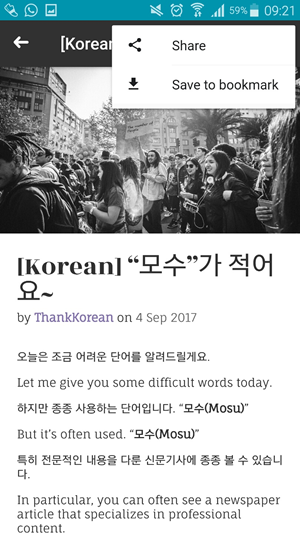
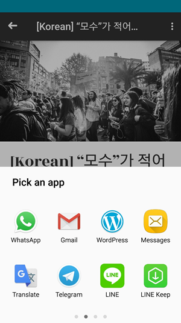
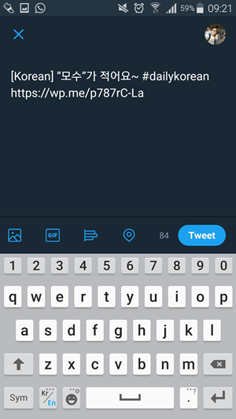

For a detailed explanation on how things work, check out the [guide](http://vuejs-templates.github.io/webpack/) and [docs for vue-loader](http://vuejs.github.io/vue-loader).
